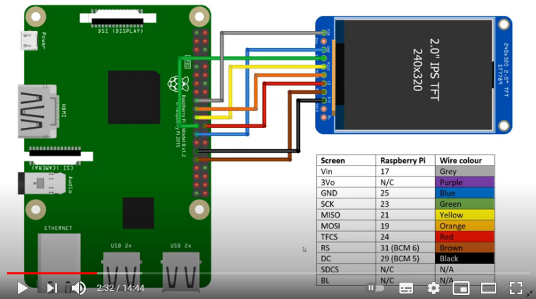

# SimpsonsTV

Reproduce capítulos aleatorios de los Simpsons.  
Podría ser consola de videojuegos.  

Basado en https://www.thingiverse.com/thing:4943159  
Guía original https://withrow.io/simpsons-tv-build-guide  
Repo original https://github.com/buba447/simpsonstv  

Cambios realizados
- Pantalla un poco diferente http://www.lcdwiki.com/2.4inch_SPI_Module_ILI9341_SKU:MSP2402
- Ensamblaje más fácil, se necesita menos pegamento
- Conectores de rasp accesibles desde afuera
- Emulación de videojuegos con RetroPie

## Instrucciones de armado
Imprimir piezas. Se necesitan 3 colores ...



## Instrucciones de instalación de software

### Retropie
Descargar imagen de RetroPie. Elegir la opción "Raspberry Pi 0/1"  
https://retropie.org.uk/download/  

Grabar en Micro SD usando Raspberry Imager.  
https://www.raspberrypi.org/software/  

Conectar a red wifi y activar ssh.

Opcional Kodi y gamepad  
Se intentó instalar Kodi dentro de RetroPie, pero la instalación falla. Al parecer intenta descargar archivos que ya no están en línea. Posiblemente se solucione cuando se publique una actualización.  
Si un día se puede instalar, este video puede ser útil  
https://www.youtube.com/watch?v=bR6NMkgRYuU

Configuración inicial de RetroPie (gamepad)
https://retropie.org.uk/docs/Controller-Configuration/

### Controlador de pantalla  
https://github.com/juj/fbcp-ili9341  
Clonar repo, entrar al directorio, crear directorio "build" y entrar a ese nuevo directorio
```bash
git clone https://github.com/juj/fbcp-ili9341.git
cd fbcp-ili9341
mkdir build
cd build
```

Generar archivos de configuración con los parámetros de nuestra pantalla
```bash
cmake -DILI9341=ON -DGPIO_TFT_DATA_CONTROL=5 -DGPIO_TFT_RESET_PIN=6 -DSPI_BUS_CLOCK_DIVISOR=6 -DSTATISTICS=0 ..
```

Parámetros opcionales
- DSTATISTICS=1 para mostrar información en la pantalla.
- DGPIO_TFT_BACKLIGHT=16 para controlar la retroiluminación con un GPIO.

Ahora compilar y lanzar el ejecutable recién compilado para probar
```bash
make
sudo ./fbcp-ili9341
```

Lanzar el programa en el arranque  
Editar `/etc/rc.local`
```
# Lanzar programa para la pantalla SPI
sudo /home/pi/fbcp-ili9341/build/fbcp-ili9341 &
```

Para detener programa de la pantallita ejecutar `sudo pkill fbcp`

Aquí hay un video para entender cómo usar el controlador. El diagrama de conexión se tomó del video. No se deben seguir todos los pasos.  
https://www.youtube.com/watch?v=KciKqGX8g94  

Instalar usbmount (ya viene instalado con RetroPie). Monta memoria USB automáticamente como `/media/usb`
```
sudo apt-get install usbmount
sudo nano /lib/systemd/system/systemd-udevd.service
PrivateMounts=no
sudo reboot
```

Para quitar memoria USB
```
sudo umount /media/usb
```

Copiar videos. Copiar scripts pyhon. Copiar juegos (opcional).  
**Usando el explorador de archivos de Windows**  
Primero reiniciar el servicio samba (que ya viene instaldado con Retropie)  
```
sudo service smbd restart
```
Abrir una ventana de explorador y escribir la dirección `\\retropie`  

**Usando ssh**
```
ssh pi@retropie
rasp
```
En otra ventana
```
scp ./* pi@retropie:/home/pi/simpsonstv/videos/
```

**Usando memoria USB**  
Conectar memoria USB y escribir comando
```
sudo cp /media/usb/simp/* /home/pi/simpsonstv/videos/
```

Este es el repo original https://github.com/buba447/simpsonstv  
El script de los botones se modificó. Ahora funciona con un push button simple.   

Activar audio por GPIO 18 y 19
sudo nano /boot/config.txt 
dtparam=audio=on
dtoverlay=audremap,enable_jack,pins_18_19

Para deshabilitar audio por GPIO 18 (no es necesario)
sudo nano /etc/rc.local
agregar
raspi-gpio set 18 op dl
raspi-gpio set 19 op a5 
raspi-gpio set 8 a2
raspi-gpio set 7 a2

Desactivar texto de arranque
sudo /boot/cmdline.txt
editar
console=tty3

quitar (no se hizo)
fsck.repair=yes

agregar al final (no se hizo)
consoleblank=0 logo.nologo quiet splash

Instalar omxplayer (ya está instalado)
sudo apt-get install omxplayer

Por hacer:
- función para cambiar videos y cambiar a modo consola de juegos con botones frontales.
- Obtener salida de audio por HDMI y GPIO de forma simultánea

Notas sobre el audio  
La salida de audio por GPIO también se puede configurar de esta forma  
https://shallowsky.com/blog/hardware/pi-zero-audio.html  
https://www.youtube.com/watch?v=3pXB90IDNoY  
https://learn.adafruit.com/adding-basic-audio-ouput-to-raspberry-pi-zero/pi-zero-pwm-audio  

A veces se escucha un zumbido, no importa el GPIO que se utilize. Para solucionarlo se puede poner un circuito para filtrar, o poner una resistencia en serie con la bocina, esta forma no reduce por completo el zumbido, pero sí se reduce mucho.

## Cotización
Está en el Drive de Invento. El archivo se llama "Cotización Mini Arcade y TV de los Simpsons"
